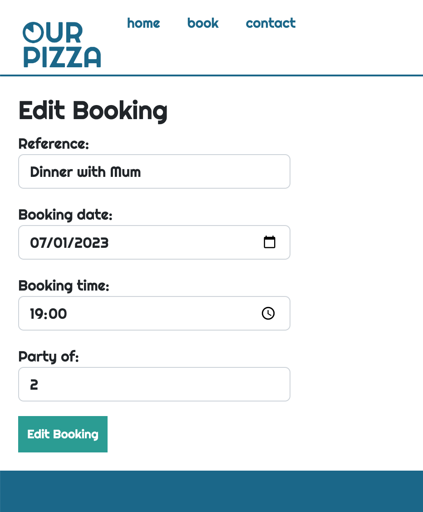
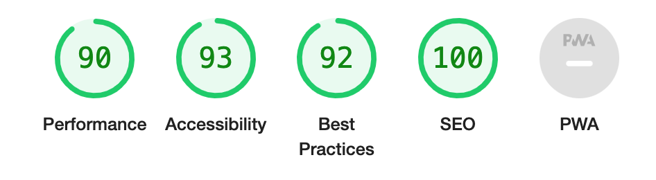

# Our Pizza

Our Pizza is a local resturant who desired a wesbite where theor customers could request bookings online, and the site manager could access their bookings. Both the customer and site manager needed to be able to:
- Request new bookings
- View all their upcoming pending bookings
- View all their upcoming approved bookings
- Have the ability to edit their bookings
- Have the ability to cancel their bookings 

The Site manager also requested a way to approve pending bookings for customers. 
The website also needed to show new customers what Our Pizza is and what makes it special. 

## Design
The design of the wesbite needed to be uncomplicated but bold. This was reflected in the font and colour choices.  The actual design was created in Adobe Illustrator. 

### Mock up 
The website is intended to reflect that feel of the resturant. Friendly, welcoming, fun and fresh.

After creating the logo for the website it was clear how the website should be a brighter to compliment the colours and the feel fo the website well. 

I used Adobe Illustrator to put the mock up together for this website. The layour of the page as intended to be very linier and clear.  The design allowed for a poll at the bottom of the page as well as a booking in form. The design used icons to create interest to different sections.  The tomato and pepper draw the idea to an otherwise boring area to most users. The Colours are intended to be bright but diverse. 

### Design Edits
When putting the design into practice, the poll at the bottom of the home page wasn't something I was able to include in this project. This is definately a future feature now. 

When Implimenting the bottom "book now" section, it seemed unfinished and didn't match the rest of the website. There would be a better way to impliment this feature as a pop out etc. in the future. 

## Features
When the user opens the home page, the slogan of the website will appear as if it is being written for the customer in letter by letter formation. This is a personal touch. Cheeky, personable and fun. 

### Bookings
When the user clicks the book button in the home page, they are directed to a log in page. If they aren't signed up already, there is also an option in the header to register for the website. 
When logged in, the user is shown all of their upcoming bookings which have been approved. 

If they wish to view their bookings which haven't yet been approved by the website, they have the option to click on the 'view pending bookings' button. 

The user has the ability to edit and cancel their bookings. 

If the customer edits their booking, this updates their booking to pending meaning that resturant will need to re-approve their booking. This was an important feature to create as it wouldn't be good for a customer to edit their booking from 2 people to 10 people without the resturant being aware. 

The customer also has the option cancel their booking which will remove their booking completely. 

### Admin Portal
The admin portal can be found in the footer of the website and can only be accessed as the superuser. If the user isnt' currently logged in at all, they will be directed to the log in page. If they are currently logged in as another user, they will be directed to their own booking page.

The admin portal is design to be a place where all upcoming bookings can be views in upcoming order. The table shows all the relevant details for the booking and if it is approved or pending. If the booking is pending, the 'approve' button appears. 

If the admin decides to update the booking, the booking remains as its bookings statues. ie. if the booking was already approved, it remains approved. If it was pending, it remains pending.

### Future Features
- Polls to interact with the user on the home page
- Social media feed to feature on the contact page 
- Option for customers to leave reviews / rank their experience. 

## Testing

The website and all links/ features have been tested on both mobile and laptop. On laptop, the browser was Chrome, on movile, the browser was Safari.
Media queries created were suitable for each screen size and didn't negatively affect the ratio of images etc. 

### HTML:
The wesbites pages were run through the W3C Validator. Minor errors were picked up and and corrected simply. Now shows no errors.

### CSS:
The created CSS was run through the Jigsaw CSS Validator. Minor errors were picked up and and corrected simply.Now shows no errors. 

### Javascript:
The Javascript was run through the PJ Hint Validator. 15 warnings appeared all related to irrelevant features.

### Lighthouse
When initially run through the lighthouse report, the images for mobile were too large. Smaller image version were then implimented for smaller screen sizes.  These were amended and scores are now positive.

## Deployment

# Credits

